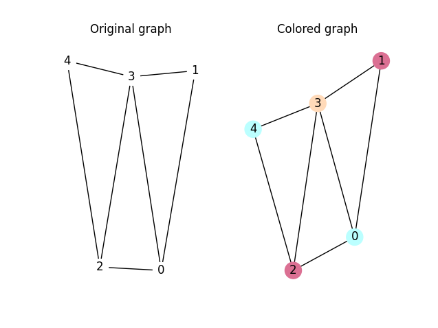

# Graph Coloring Linear Solver

## Introduction

The problem is to color a graph with the minimum number of colors. The graph is reepresented by an adjency list, as for the moment, the problem remains a NP-complete task. In this repository, I present a solution to solve the problem using linear optimization. The solution is implemeneted using Python and Ortools from Google.

## Problem Statement and Solution
Contained in the [problem statement](./Problem_statement.pdf) file.

## Installation
Hop onto your console, make sure you have Python3 installed, and run the following commands:

````
python3 -m venv venv
. venv/bin/activate
pip install -r requirements.txt
````
## API 

You can run the code using the default configuration for pre-defined graph.
Or, you can run the matrix using your own graph. Run the script as follows:

````
cd src
python3 main.py
````

After executed, the script will ask you to enter the number of nodes and the number of edges. Then, you will be asked to enter the edges. The edges are entered as follows:

````
first_node second_node
````
representing there is an edge between these two nodes. The nodes are indexed from 0 to n-1 with $n$ being the number of the nodes. If the number of nodes are less then 30, after showing you the solution, the script will be prompt up a window to show the solution with colors to represent it.
## Example

````
number of nodes = 5
edges = (0, 1), (0, 2), (0, 3), (2, 3), (2, 4), (3, 4), (1, 3)
````

The resulting colored graph would be as follows:
